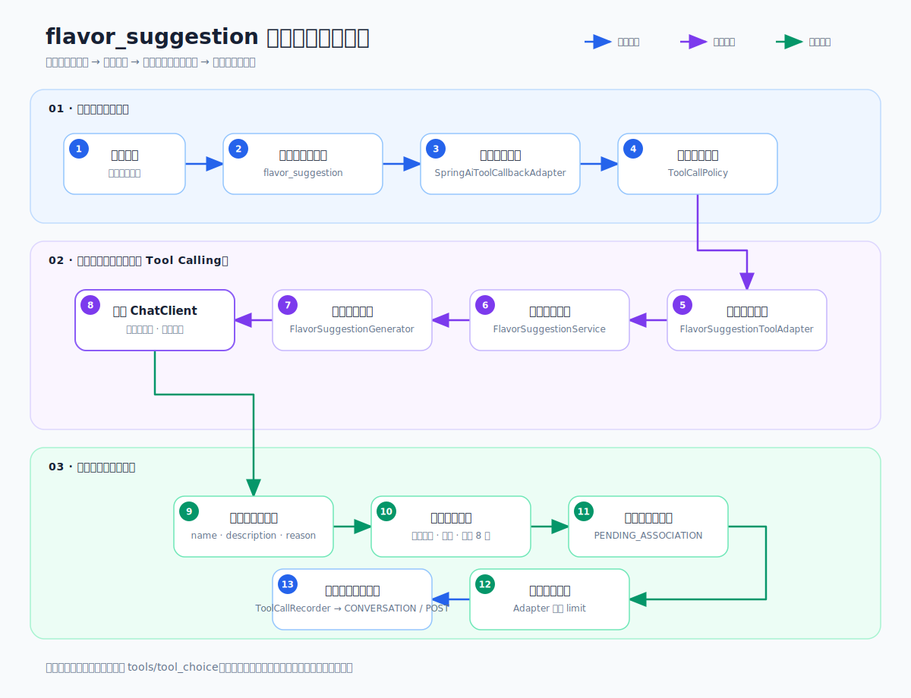

# flavor_suggestion 模型驱动风味联想改造代码审核 v0.1

## 1. 审核范围与结论

本次审核覆盖以下提交：

- `84f9ced feat: add model-driven flavor suggestions`
- `6eabbe4 fix: make flavor tool schema strict-compatible`

行号基准为 `6eabbe4`。当前工作区中其他未提交修改不属于本审核范围。

审核结论：**通过，允许进入继续联调阶段；无 P0/P1 未解决问题，有 2 项不阻塞交付的 P2 观察项。**

本次改造完成了以下核心目标：

- 删除 `FlavorSuggestionService` 中“柑橘固定返回七项”和“输入词 + 延展”的候选硬编码。
- 由专用模型根据 `inputTerm`、`temperatureStage`、`senseType` 生成结构化候选。
- 内部模型链不携带 Tool Calling 能力，阻断 `flavor_suggestion -> 模型 -> flavor_suggestion` 递归。
- Service 和 Adapter 分别执行 8 项内部上限与最终 `limit` 限制。
- 候选始终保持 `PENDING_ASSOCIATION` / `PENDING_CONFIRMATION` 事实边界。
- 模型异常、空响应和格式异常时返回空候选，不回退到编造数据。
- Prompt、字段说明、事实边界、工具定义和 JSON Schema 均已资源化。

## 2. 业务链路审核



### 2.1 主模型暴露并执行工具：沿用现有架构

| 链路步骤 | 审核结果 | 文件与行号 |
|---|---|---|
| 主模型请求绑定 `ToolCallback` | 沿用既有 `SpringAiModelGateway`，本次未改变其职责 | `backend/src/main/java/com/minyuwei/xhs/coffeeagent/agent/infrastructure/SpringAiModelGateway.java:55-70`、`:129-138` |
| `/responses` 请求写入 `tools` 和 `tool_choice=auto` | 沿用既有请求工厂 | `backend/src/main/java/com/minyuwei/xhs/coffeeagent/agent/infrastructure/OpenAiResponsesRequestFactory.java:58-69`、`:139-158` |
| 将 `function_call` 转换为 Spring AI ToolCall | 沿用既有 ChatModel 适配器 | `backend/src/main/java/com/minyuwei/xhs/coffeeagent/agent/infrastructure/ResponsesApiChatModel.java:67-75`、`:78-106` |
| 工具安全校验和调用记录 | 继续经过 `ToolCallPolicy` 与 `ToolCallRecorder`，没有绕开安全层 | `backend/src/main/java/com/minyuwei/xhs/coffeeagent/tools/infrastructure/SpringAiToolCallbackAdapter.java:61-73`；`backend/src/main/java/com/minyuwei/xhs/coffeeagent/tools/application/ToolCallPolicy.java:8-15`；`backend/src/main/java/com/minyuwei/xhs/coffeeagent/tools/application/ToolCallRecorder.java:21-38` |

### 2.2 工具输入与业务入口

1. `FlavorSuggestionToolAdapter` 继续解析 `inputTerm`、温度阶段、感官类型和 `limit`，入口契约未改变：
   - 输入校验：`backend/src/main/java/com/minyuwei/xhs/coffeeagent/tools/infrastructure/FlavorSuggestionToolAdapter.java:27-42`
   - 调用 Service 并执行最终 `.limit(limit)`：同文件 `:43-46`
   - 返回 `resultBoundary=PENDING_ASSOCIATION`：同文件 `:47-53`
   - `limit` 被约束到 `1..8`：同文件 `:73-85`
2. 工具注册器改为从资源文件加载 description、输入 Schema 和输出 Schema，不再在 Java 中硬编码 JSON：
   - 资源路径及加载：`backend/src/main/java/com/minyuwei/xhs/coffeeagent/tools/infrastructure/FlavorSuggestionToolRegistrar.java:8-18`
   - 风险、事实边界和副作用声明：同文件 `:19-32`
3. `ToolConfiguration` 继续只负责工具注册、策略、记录器和 Callback 装配；`FlavorSuggestionService` Bean 已移动到风味模块配置：
   - 工具注册：`backend/src/main/java/com/minyuwei/xhs/coffeeagent/tools/infrastructure/ToolConfiguration.java:21-25`
   - Callback 与 Advisor：同文件 `:28-49`

### 2.3 Service 从硬编码候选改为模型编排

1. 新增 `FlavorSuggestionGenerator` 应用端口，输入和输出都是类型化对象：
   - 生成方法：`backend/src/main/java/com/minyuwei/xhs/coffeeagent/flavor/application/FlavorSuggestionGenerator.java:7-8`
   - `inputTerm`、`temperatureStage`、`senseType` 请求字段：同文件 `:10-15`
   - `name`、`description`、`reason` 候选字段：同文件 `:17-22`
2. `FlavorSuggestionService` 通过构造器依赖生成端口，不直接创建 `ChatClient`、读取 Key 或处理 JSON：
   - 依赖注入：`backend/src/main/java/com/minyuwei/xhs/coffeeagent/flavor/application/FlavorSuggestionService.java:11-18`
   - 保持原 `suggest(...)` 方法签名：同文件 `:20`
3. Service 将输入上下文完整传给模型生成端口：同文件 `:25-28`。
4. Service 对模型结果执行二次业务防御：
   - 空响应安全降级：同文件 `:28-33`
   - 空字段过滤：同文件 `:60-70`
   - 名称大小写去重：同文件 `:35-45`
   - 最多保留 8 个：同文件 `:12`、`:42-44`
5. 过滤后的候选统一映射为待确认领域对象：同文件 `:47-57`。

### 2.4 专用模型链与递归阻断

递归阻断不是只依赖 Prompt，而是由装配和请求结构共同保证：

1. `FlavorSuggestionConfiguration` 单独创建 `FlavorSuggestionResponsesChatModel` 和 `ChatClient`：
   - 专用 ChatModel：`backend/src/main/java/com/minyuwei/xhs/coffeeagent/flavor/infrastructure/FlavorSuggestionConfiguration.java:25-39`
   - `ChatClient.builder(dedicatedModel).build()` 没有注册 `ToolCallingAdvisor` 或 `ToolCallback`：同文件 `:40-41`
2. 专用请求工厂只写入 `model`、`instructions`、`reasoning`、`max_output_tokens`、`input` 和结构化 `text.format`：
   - Prompt 资源加载与动态字段替换：`backend/src/main/java/com/minyuwei/xhs/coffeeagent/flavor/infrastructure/FlavorSuggestionModelRequestFactory.java:15-38`
   - Responses 请求体：同文件 `:40-54`
   - 该请求体没有构造 `tools` 或 `tool_choice` 字段。
3. `FlavorSuggestionResponsesChatModel` 只发送上述专用请求并包装响应，不包含任何工具回调集合：
   - 模型配置字段：`backend/src/main/java/com/minyuwei/xhs/coffeeagent/flavor/infrastructure/FlavorSuggestionResponsesChatModel.java:16-38`
   - 单次调用：同文件 `:40-45`
4. `SpringAiFlavorSuggestionGenerator` 只执行一次专用模型调用并交给解析器，不存在工具调用循环：
   - 调用与空响应校验：`backend/src/main/java/com/minyuwei/xhs/coffeeagent/flavor/infrastructure/SpringAiFlavorSuggestionGenerator.java:25-34`

结论：内部链路在 Java 装配、请求 JSON 和 Prompt 三层都不具备再次调用 `flavor_suggestion` 的能力。

### 2.5 结构化解析、事实边界与失败降级

1. 响应解析器支持直接结构化对象和 Responses API 包装中的 JSON 文本：
   - 解析 `suggestions`：`backend/src/main/java/com/minyuwei/xhs/coffeeagent/flavor/infrastructure/FlavorSuggestionModelResponseParser.java:14-35`
   - 从包装响应递归寻找结构化文本：同文件 `:38-76`
   - 缺失字段先解析为空字符串，再由 Service 过滤：同文件 `:78-84`，Service `:60-70`
2. 领域对象不把模型候选标记为正向已确认事实：
   - `pendingAssociation(...)` 工厂：`backend/src/main/java/com/minyuwei/xhs/coffeeagent/flavor/domain/FlavorSuggestion.java:26-47`
   - `polarity=NEUTRAL`、`sensoryDimensions=[]`、`status=SUGGESTED`：同文件 `:43-46`
3. 工具输出再次声明事实边界：
   - `basisType=PENDING_ASSOCIATION`：`backend/src/main/java/com/minyuwei/xhs/coffeeagent/tools/infrastructure/FlavorSuggestionToolAdapter.java:66`
   - `confirmationStatus=PENDING_CONFIRMATION`：同文件 `:67`
   - `sendStatus=SEND_AFTER_CONFIRMATION`：同文件 `:68`
4. 生成端口抛异常、返回 `null` 或返回空列表时，Service 返回空候选，不生成固定兜底词：`backend/src/main/java/com/minyuwei/xhs/coffeeagent/flavor/application/FlavorSuggestionService.java:25-33`。

## 3. 按项目文件列出的变动点

### 3.1 生产代码

| 文件 | 变动行 | 变动说明 |
|---|---:|---|
| `backend/src/main/java/com/minyuwei/xhs/coffeeagent/flavor/application/FlavorSuggestionGenerator.java` | 7-22 | 新增模型生成应用端口、类型化请求和候选 DTO。 |
| `backend/src/main/java/com/minyuwei/xhs/coffeeagent/flavor/application/FlavorSuggestionService.java` | 11-75 | 删除固定词表和字符串拼接兜底；接入生成端口；增加空值过滤、去重、8 项限制和异常空降级。 |
| `backend/src/main/java/com/minyuwei/xhs/coffeeagent/flavor/domain/FlavorSuggestion.java` | 22-47 | 新增 `pendingAssociation(...)` 工厂，模型候选使用中性极性、空感官维度和 `SUGGESTED` 状态。 |
| `backend/src/main/java/com/minyuwei/xhs/coffeeagent/flavor/infrastructure/FlavorSuggestionConfiguration.java` | 13-47 | 注册风味模块请求工厂、解析器、专用无工具模型链、生成器和 Service。 |
| `backend/src/main/java/com/minyuwei/xhs/coffeeagent/flavor/infrastructure/FlavorSuggestionModelRequestFactory.java` | 15-63 | 加载版本化 Prompt/Schema，构造不含工具定义的 Responses 请求。 |
| `backend/src/main/java/com/minyuwei/xhs/coffeeagent/flavor/infrastructure/FlavorSuggestionModelResponseParser.java` | 11-85 | 解析直接或包装后的结构化候选，格式错误时抛出统一异常。 |
| `backend/src/main/java/com/minyuwei/xhs/coffeeagent/flavor/infrastructure/FlavorSuggestionResponsesChatModel.java` | 16-63 | 新增专用 Spring AI `ChatModel`，复用 Responses HTTP 客户端但不接收 ToolCallback。 |
| `backend/src/main/java/com/minyuwei/xhs/coffeeagent/flavor/infrastructure/SpringAiFlavorSuggestionGenerator.java` | 10-35 | 实现应用端口，执行专用 ChatClient 并解析结构化响应。 |
| `backend/src/main/java/com/minyuwei/xhs/coffeeagent/agent/infrastructure/prompt/PromptTemplateLoader.java` | 37-42 | 增加 JSON 资源加载与解析能力。 |
| `backend/src/main/java/com/minyuwei/xhs/coffeeagent/tools/infrastructure/FlavorSuggestionToolRegistrar.java` | 8-33 | 工具 description、输入 Schema、输出 Schema 从资源文件加载。 |
| `backend/src/main/java/com/minyuwei/xhs/coffeeagent/tools/infrastructure/ToolConfiguration.java` | 21-25 | 工具注册改为消费风味模块提供的 Service 和资源加载器；不再在工具模块创建 Service。 |

### 3.2 Prompt 与 JSON 资源

| 文件 | 变动行 | 变动说明 |
|---|---:|---|
| `backend/src/main/resources/prompts/flavor/model-flavor-suggestion-system-v1.md` | 3-30 | 定义输入字段、咖啡感官范围、非编造规则、8 项上限、`PENDING_ASSOCIATION` 事实边界、结构化输出和禁用工具规则。 |
| `backend/src/main/resources/prompts/flavor/model-flavor-suggestion-user-task-v1.md` | 3-7 | 以占位符注入 `inputTerm`、温度阶段和感官类型。 |
| `backend/src/main/resources/prompts/flavor/model-flavor-suggestion-output-schema-v1.json` | 2-44 | 定义 strict 结构化输出，候选必含 `name`、`description`、`reason`，数组最多 8 项。 |
| `backend/src/main/resources/prompts/tools/flavor-suggestion/definition-v1.json` | 2-141 | 资源化工具 description、输入/输出 Schema 和事实边界字段。 |
| `backend/src/main/resources/prompts/tools/flavor-suggestion/definition-v1.json` | 6-12 | 修复 strict function schema：`required` 覆盖全部输入 properties，解决代理 HTTP 400。 |

### 3.3 测试代码与夹具

| 文件 | 变动行 | 覆盖内容 |
|---|---:|---|
| `backend/src/test/java/com/minyuwei/xhs/coffeeagent/flavor/application/FlavorSuggestionServiceTest.java` | 16-38 | 模型候选转换、温度阶段与感官类型传递、待确认领域状态。 |
| 同上 | 42-64 | 空名称过滤、名称去重、最多 8 项。 |
| 同上 | 68-85 | 模型异常和空结果时不编造候选。 |
| `backend/src/test/java/com/minyuwei/xhs/coffeeagent/flavor/infrastructure/SpringAiFlavorSuggestionGeneratorTest.java` | 28-53 | 专用模型链结构化转换；请求体不含 `tools` / `tool_choice`；动态输入正确进入请求。 |
| 同上 | 56-66 | 格式异常安全降级为空列表。 |
| 同上 | 70-87 | Prompt 可加载、占位符被替换、Schema 可解析、最多 8 项。 |
| `backend/src/test/java/com/minyuwei/xhs/coffeeagent/support/FakeFlavorSuggestionGenerator.java` | 7-36 | 提供可控候选、异常注入和请求捕获，不调用真实模型。 |
| `backend/src/test/java/com/minyuwei/xhs/coffeeagent/tools/infrastructure/FlavorSuggestionToolAdapterTest.java` | 15-46 | Adapter 最终 `limit`、`PENDING_ASSOCIATION` 和确认后发送边界。 |
| `backend/src/test/java/com/minyuwei/xhs/coffeeagent/agent/infrastructure/OpenAiResponsesToolRequestFactoryTest.java` | 32-54 | 工具 Schema 序列化；校验 strict Schema 的 `required` 与 `properties` 完全一致。 |
| `backend/src/test/java/com/minyuwei/xhs/coffeeagent/tools/infrastructure/SpringAiToolCallbackAdapterTest.java` | 17-48 | 工具 Callback、Policy、Recorder 和可控生成替身。 |
| `backend/src/test/java/com/minyuwei/xhs/coffeeagent/agent/infrastructure/SpringAiModelGatewayTest.java` | 108-140 | 模拟主模型调用工具、记录工具调用、发送 `function_call_output` 并解析最终消息。 |
| `backend/src/test/java/com/minyuwei/xhs/coffeeagent/agent/infrastructure/fixtures/ModelResponseFixtures.java` | 13-96 | 将模型响应夹具迁移为资源加载，并支持异常结构变体。 |
| `backend/src/test/java/com/minyuwei/xhs/coffeeagent/agent/infrastructure/OpenAiResponsesParserTest.java` | 16-92 | 使用资源化夹具继续覆盖 CONVERSATION、POST 和异常结构。 |
| `backend/src/test/java/com/minyuwei/xhs/coffeeagent/support/ApiContractTestSupport.java` | 19-25 | 使用 Jackson 序列化测试请求，移除测试中的手写 JSON。 |
| `backend/src/test/java/com/minyuwei/xhs/coffeeagent/support/TestRunner.java` | 38-39 | 保留 ToolAdapter 和 ToolCallback 行为测试入口；旧固定“柑橘七项”测试已删除。 |
| `backend/src/test/resources/prompts/fixtures/model-responses/flavor-suggestions-v1.json` | 1-13 | 合法风味结构化响应夹具。 |
| `backend/src/test/resources/prompts/fixtures/model-responses/flavor-suggestions-invalid-v1.json` | 1-13 | 格式异常响应夹具。 |
| `backend/src/test/resources/prompts/fixtures/model-responses/flavor-suggestion-tool-call-v1.json` | 1-10 | 主模型 `function_call` 夹具。 |
| `backend/src/test/resources/prompts/fixtures/model-responses/conversation-v1.json` | 1-40 | CONVERSATION 响应夹具。 |
| `backend/src/test/resources/prompts/fixtures/model-responses/post-v1.json` | 1-61 | POST 响应夹具。 |
| `backend/src/test/resources/prompts/fixtures/model-responses/invalid-minimal-v1.json` | 1-3 | 最小非法响应夹具。 |

原 `backend/src/test/java/com/minyuwei/xhs/coffeeagent/flavor/application/FlavorSuggestionAgentTest.java:1-14` 已删除，其“柑橘固定返回至少五项并包含甜橙”的假设由 `FlavorSuggestionServiceTest` 的模型替身测试取代。

## 4. 代码审核发现

### 4.1 已解决问题

#### [已解决 P1] strict Tool Schema 导致所有真实模型请求返回 HTTP 400

- 原因：工具输入 `properties` 包含 `temperatureStage`、`senseType`、`limit`，但 `required` 只包含 `sessionId` 和 `inputTerm`。Responses strict function schema 要求全部 properties 都出现在 required 中。
- 修复位置：`backend/src/main/resources/prompts/tools/flavor-suggestion/definition-v1.json:6-12`。
- 回归测试：`backend/src/test/java/com/minyuwei/xhs/coffeeagent/agent/infrastructure/OpenAiResponsesToolRequestFactoryTest.java:49-54`。
- 验证：修复前重放应用真实请求返回 HTTP 400 和 `invalid_function_parameters`；修复后真实工作台请求返回 HTTP 200、`messageType=CONVERSATION`、`recoverableError=null`。

#### [已解决 P1] 固定词表与伪造兜底

- 原实现对“柑橘”固定返回七项，对其他词拼接“输入词 + 延展”。
- 当前实现只消费生成端口结果；生成失败或为空时返回空列表：`backend/src/main/java/com/minyuwei/xhs/coffeeagent/flavor/application/FlavorSuggestionService.java:20-33`。

#### [已解决 P1] 内部模型递归调用工具风险

- 专用 ChatClient 不注册主链 ToolCallingAdvisor：`backend/src/main/java/com/minyuwei/xhs/coffeeagent/flavor/infrastructure/FlavorSuggestionConfiguration.java:32-41`。
- 专用请求体不构造 `tools`：`backend/src/main/java/com/minyuwei/xhs/coffeeagent/flavor/infrastructure/FlavorSuggestionModelRequestFactory.java:40-54`。
- 自动测试直接断言请求无 `tools` 和 `tool_choice`：`backend/src/test/java/com/minyuwei/xhs/coffeeagent/flavor/infrastructure/SpringAiFlavorSuggestionGeneratorTest.java:45-48`。

### 4.2 未阻塞交付的观察项

#### [P2] 模型异常被静默转换为空列表，缺少可观测记录

- 位置：`backend/src/main/java/com/minyuwei/xhs/coffeeagent/flavor/application/FlavorSuggestionService.java:25-30`。
- 当前行为符合“不编造候选”的安全降级要求，但模型超时、鉴权、限流和格式错误最终都表现为“空候选”，工具调用记录无法区分真实无候选与模型故障。
- 建议：后续在不改变 `suggest(...)` 契约的前提下，为生成失败增加脱敏的 Trace/指标，例如 `FLAVOR_GENERATION_FAILED`、错误类别和耗时；不得记录 Prompt 全文或凭证。

#### [P2] “必须属于咖啡感官范围”主要依赖 Prompt，缺少确定性领域校验

- Prompt 约束：`backend/src/main/resources/prompts/flavor/model-flavor-suggestion-system-v1.md:11-18`。
- Service 当前只验证 `name`、`description`、`reason` 非空并做名称去重：`backend/src/main/java/com/minyuwei/xhs/coffeeagent/flavor/application/FlavorSuggestionService.java:35-45`、`:60-70`。
- 风险：真实模型仍可能返回结构合法但超出咖啡感官范围的词。
- 建议：先通过真实样本观察误差；如果出现稳定越界，再增加轻量 `FlavorCandidateValidator` 或咖啡风味分类约束，不建议立即引入庞大固定词库重新制造硬编码。

## 5. 测试与验证矩阵

| 验收行为 | 自动测试证据 | 结果 |
|---|---|---|
| 模型候选转换为 `FlavorSuggestion` | `FlavorSuggestionServiceTest.java:16-38` | PASS |
| 空候选过滤 | `FlavorSuggestionServiceTest.java:42-64` | PASS |
| 重复名称去重 | `FlavorSuggestionServiceTest.java:42-64` | PASS |
| 最多保留 8 个 | `FlavorSuggestionServiceTest.java:49-64`、输出 Schema `:12-15` | PASS |
| 温度阶段和感官类型正确传递 | `FlavorSuggestionServiceTest.java:22-31`、`SpringAiFlavorSuggestionGeneratorTest.java:49-52` | PASS |
| 待确认事实边界 | `FlavorSuggestionServiceTest.java:32-38`、`FlavorSuggestionToolAdapterTest.java:41-46` | PASS |
| Adapter 的最终 `limit` | `FlavorSuggestionToolAdapterTest.java:34-46` | PASS |
| Prompt/JSON 资源加载和解析 | `SpringAiFlavorSuggestionGeneratorTest.java:69-87` | PASS |
| 内部模型调用不携带工具定义 | `SpringAiFlavorSuggestionGeneratorTest.java:45-48` | PASS |
| 模型异常或格式异常安全降级 | `FlavorSuggestionServiceTest.java:68-85`、`SpringAiFlavorSuggestionGeneratorTest.java:55-67` | PASS |
| Tool Schema strict 兼容 | `OpenAiResponsesToolRequestFactoryTest.java:49-54` | PASS |
| 主模型工具调用双轮链路 | `SpringAiModelGatewayTest.java:108-140` | PASS |

验证命令：

```bash
JAVA_HOME=/opt/homebrew/Cellar/openjdk/25.0.2/libexec/openjdk.jdk/Contents/Home \
PATH=/opt/homebrew/Cellar/openjdk/25.0.2/bin:$PATH \
./mvnw test
```

结果：后端 `40 tests, 0 failures, 0 errors`。

真实联调记录：

- 使用 `~/.codex/config.toml` 中的模型 `gpt-5.6-sol` 和本地 Responses 代理启动后端。
- 前端 `http://127.0.0.1:5173/`、后端 `/api/workbench/snapshot` 均返回 HTTP 200。
- strict Schema 修复后，真实工作台消息返回 HTTP 200、`status=WAITING_FOR_FACTS`、`messageType=CONVERSATION`、`recoverableError=null`。
- 真实模型是否选择调用工具仍由模型决策；自动测试已经覆盖实际 `function_call -> ToolCallback -> function_call_output` 闭环，但本轮真实联调返回的是模型直接 CONVERSATION，不能据此宣称真实模型必然调用工具。

环境说明：

- 本机 shell 默认 Java 8；验证使用 OpenJDK 25，并由 Maven `--release 21` 编译。
- Maven 仍报告本地 JUnit BOM POM 内容异常警告，但未阻断本次测试。

## 6. 审核决策与后续建议

审核决策：**APPROVED WITH OBSERVATIONS**。

建议后续按以下顺序推进：

1. 使用真实咖啡输入样本观察模型候选是否稳定处于咖啡感官范围。
2. 为内部模型失败增加脱敏 Trace/指标，区分“无可靠候选”和“模型调用失败”。
3. 在工作台状态区展示工具是否实际被调用、候选数量和失败类别，继续强化 Agent 状态可追踪性。
4. 不建议重新引入固定风味词表作为兜底；如需确定性校验，应采用轻量分类或校验器，而不是恢复按关键词硬编码候选。
